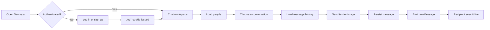
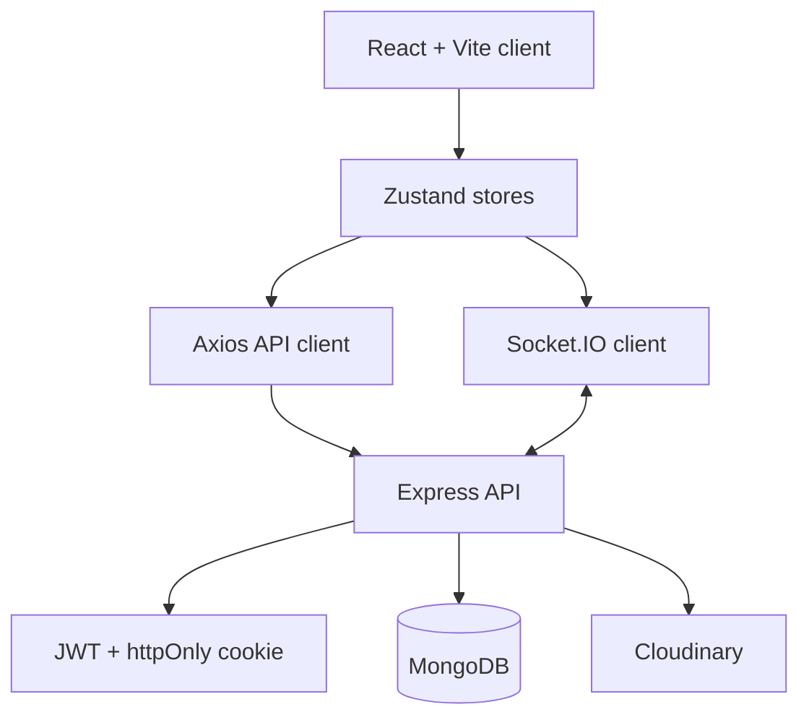

<div align="center">

# Samlapa

### Conversations that feel immediate.

A full-stack real-time chat experience built for simple, expressive, and dependable communication.

[](https://react.dev/)
[](https://nodejs.org/)
[](https://www.mongodb.com/)
[](https://socket.io/)

</div>

---

## The idea

Samlapa is a focused messaging application where the path from signing in to starting a conversation stays wonderfully short. Users can create an account, discover other people, choose a conversation, exchange text or images, and see presence changes as they happen.

The project combines a responsive React interface with an Express API, MongoDB persistence, Socket.IO events, cookie-based authentication, and Cloudinary media storage. The result is a compact but complete full-stack product surface that is easy to understand and ready to extend.

> **A small app with the important pieces of a real product:** identity, persistence, media, real-time events, protected routes, and a polished client experience.

## What makes it engaging

| Experience | What users get |
| --- | --- |
| **Fast entry** | Sign up or log in, then land directly in the conversation workspace. |
| **People-first sidebar** | Browse the available user list and choose who to message. |
| **Live conversations** | Receive new messages through Socket.IO without refreshing the page. |
| **Online presence** | See which connected users are currently online. |
| **Visual identity** | Upload and update a profile picture through Cloudinary. |
| **Personal atmosphere** | Switch themes from the settings experience, with the selected theme persisted locally. |
| **Helpful feedback** | Loading states, skeletons, route guards, and toast notifications keep the interface understandable. |

## Product flow



## Architecture at a glance



### Runtime responsibilities

- **Frontend:** React pages and components render authentication, profile, settings, navigation, the user sidebar, and the active chat.
- **State layer:** Zustand stores coordinate auth state, socket lifecycle, online users, selected users, messages, loading states, and theme persistence.
- **HTTP layer:** Axios communicates with the protected auth and message routes.
- **Realtime layer:** Socket.IO maps connected user IDs to socket IDs and broadcasts presence and incoming message events.
- **Backend:** Express assembles middleware, routes, controllers, persistence, security headers, and production static-file serving.
- **Data layer:** Mongoose models represent users and messages in MongoDB.
- **Media layer:** Cloudinary stores profile images and image attachments sent in messages.

## Repository structure

```text
Samlapa/
|-- backend/
|   |-- src/
|       |-- controllers/
|       |   |-- auth.controller.js       # signup, login, logout, profile, session checks
|       |   |-- message.controller.js    # people, history, and message delivery
|       |-- lib/
|       |   |-- cloudinary.js             # media storage configuration
|       |   |-- db.js                     # MongoDB connection
|       |   |-- socket.js                 # Socket.IO server and online-user map
|       |   |-- utils.js                  # JWT cookie creation
|       |-- middleware/
|       |   |-- auth.middleware.js        # protected-route authentication
|       |-- models/
|       |   |-- messages.model.js         # message schema
|       |   |-- users.model.js            # user schema
|       |-- routes/
|       |   |-- auth.routes.js            # account and session endpoints
|       |   |-- message.routes.js         # chat endpoints
|       |-- seeds/
|           |-- user.seed.js              # sample data helper
|       |-- index.js                      # application bootstrap
|   |-- package.json
|-- frontend/
|   |-- src/
|       |-- components/                   # reusable chat and navigation UI
|       |-- components/skeletons/         # loading placeholders
|       |-- constants/                    # client constants
|       |-- lib/                          # Axios and UI helpers
|       |-- pages/                        # route-level screens
|       |-- store/                        # Zustand application state
|       |-- App.jsx                       # route guards and app shell
|       |-- App.css                       # component styling
|       |-- index.css                     # global styling and theme foundation
|       |-- main.jsx                      # React entry point
|   |-- public/                           # static client assets
|   |-- package.json
|   |-- vite.config.js
|-- Dockerfile                            # container build entry point
|-- package.json                          # root build and start scripts
```

## Core screens

### Authentication

- **Login:** existing users return to the workspace.
- **Sign up:** new users receive validation for required fields, email format, password length, and duplicate accounts.
- **Protected routing:** unauthenticated users are redirected to login, while authenticated users cannot revisit the login and signup screens.

### Chat workspace

The home screen is organized around a familiar two-panel pattern:

1. **Sidebar:** the available people to message.
2. **Conversation area:** the selected user's profile context, message history, composer, and empty state when no conversation has been chosen.

Messages support text and optional images. The server saves the message first, then emits a `newMessage` event to the recipient when they are online.

### Profile and settings

The profile view lets users update their profile picture. The settings view exposes the theme experience, while the theme store remembers the selected theme in browser storage.

## API surface

All message routes and profile updates require the authenticated JWT cookie.

| Method | Endpoint | Purpose |
| --- | --- | --- |
| `POST` | `/api/auth/signup` | Create an account and issue a session cookie. |
| `POST` | `/api/auth/login` | Validate credentials and issue a session cookie. |
| `POST` | `/api/auth/logout` | Clear the current session cookie. |
| `GET` | `/api/auth/check` | Restore the current authenticated user. |
| `PUT` | `/api/auth/update-profile` | Upload and save a profile picture. |
| `GET` | `/api/messages/users` | Return all other users for the sidebar. |
| `GET` | `/api/messages/:id` | Return the conversation with a selected user. |
| `POST` | `/api/messages/send/:id` | Send a text and/or image message. |

### Realtime events

| Event | Direction | Meaning |
| --- | --- | --- |
| `getOnlineUsers` | Server to clients | Publishes the IDs of connected users. |
| `newMessage` | Server to recipient | Delivers a newly saved message in real time. |

## Technology choices

### Frontend

- React 19
- Vite
- React Router
- Zustand
- Axios
- Socket.IO Client
- Tailwind CSS and DaisyUI
- Lucide React
- React Hot Toast

### Backend

- Node.js with ES modules
- Express
- MongoDB with Mongoose
- Socket.IO
- JSON Web Tokens
- bcryptjs
- Cloudinary
- Helmet, CORS, cookie-parser, dotenv, and validator

## Data model

### User

```text
User
|-- fullName
|-- email (unique)
|-- password (hashed)
|-- profilePic
|-- createdAt
|-- updatedAt
```

### Message

```text
Message
|-- senderId
|-- receiverId
|-- text (optional)
|-- image (optional Cloudinary URL)
|-- createdAt
|-- updatedAt
```

A message can contain text, an image, or both. Sender and receiver IDs connect each message to the users involved in the conversation.

## Getting started

### Requirements

- Node.js 18 or newer
- MongoDB connection string
- Cloudinary account for profile and message images

### Environment variables

Create a `.env` file inside `backend/`:

```env
PORT=5000
MONGO_URL=your_mongodb_connection_string
JWT_SECRET=replace_with_a_long_random_secret
CLOUDINARY_CLOUD_NAME=your_cloud_name
CLOUDINARY_API_KEY=your_api_key
CLOUDINARY_API_SECRET=your_api_secret
NODE_ENV=development
```

### Development

Install dependencies for both applications:

```bash
npm install --prefix backend
npm install --prefix frontend
```

Start the backend:

```bash
npm run dev --prefix backend
```

Start the frontend in a second terminal:

```bash
npm run dev --prefix frontend
```

The client runs on `http://localhost:5173` and the API listens on port `5000` by default.

### Production build

From the repository root:

```bash
npm run build
npm start
```

The root build script installs both workspaces and builds the frontend. The backend serves the generated frontend build when `frontend/dist` is available.

## Security and resilience details

- Passwords are hashed with `bcryptjs` before storage.
- JWT sessions are stored in an httpOnly cookie.
- Protected routes pass through authentication middleware.
- Helmet applies security headers and a content security policy.
- CORS is configured for the local frontend during development.
- User lists omit password and internal version fields.
- Request body limits help keep large payloads bounded.
- The client exposes loading and error feedback during async operations.

## Why this project is a strong foundation

Samlapa already has the architecture needed for meaningful product growth without losing its clarity. Future additions can fit naturally into the existing boundaries:

- group conversations and channels
- read receipts and typing indicators
- message reactions and replies
- search across conversations
- stronger presence states such as away and busy
- pagination for long message histories
- automated tests for controllers, stores, and chat flows
- deployment with managed MongoDB, Cloudinary, and a container platform

The important part is already in place: a clean loop from user identity to stored data to live UI feedback.

---

<div align="center">

### Built to keep conversations moving.

**Samlapa** brings authentication, presence, media, and messaging together in one approachable full-stack experience.

</div>
